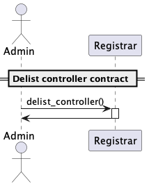

# Admin functions

## Registry admin

### Whitelist registrar

_used also to delist a registrar_

## Registrar admin

### Expire a domain

### Burn a domain

### Whitelist a controller contract

### Delist a controller contract

`whitelist_controller(package_hash Address, enabled bool)`

