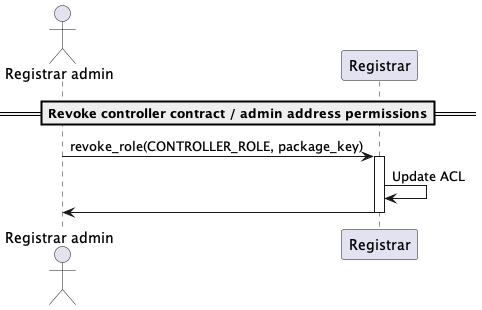
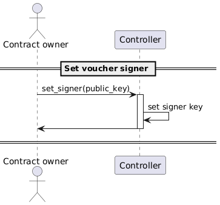
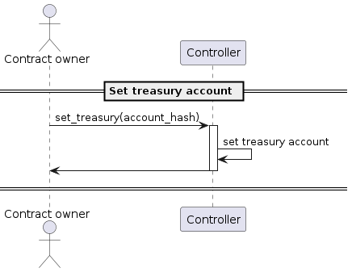
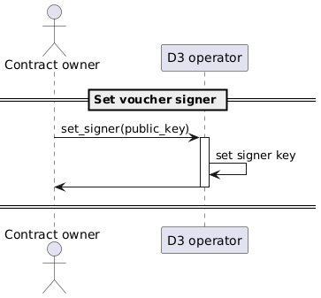
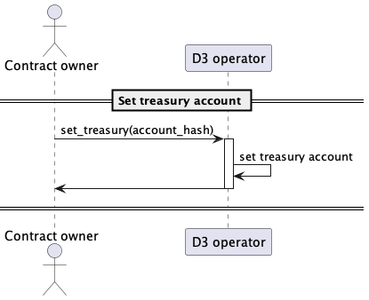

# Admin functions

## NameToken admin functions

### Whitelist registrar contract

> As the NameToken contract admin, I should be able to whitelist a Registrar contract, so that it can mint new *cspr name 
> tokens in the registry.
> 

[🔗](puml/whitelist-registrar.puml)

_used also to delist a registrar_

## Registrar admin functions

### Whitelist a controller contract or admin address

> As a Registrar admin, I should be able to whitelist a controller contract or admin account address,
> so that they can mint and renew cspr name tokens, and call admin contract methods.

[🔗](puml/whitelist-controller.puml)

### Revoke a controller contract or admin address

> As a Registrar admin, I should be able to revoke a controller contract or admin account address.

[🔗](puml/revoke-controller.puml)

### Set grace period time span

> As a registrar admin, I should be able to set the duration of the grace period.

[🔗](puml/set-grace-period.puml)

### Expire domains

> As the registrar contract, I should burn expired tokens in batches upon request.

[🔗](puml/expire-domain.puml)

### Transfer domains

> As a D3 admin, I should be able to transfer a batch of cspr name tokens.

[🔗](puml/admin-transfer-domain.puml)

### Burn domains

> As a D3 admin, I should be able to burn a batch of cspr name tokens.

[🔗](puml/burn-domain.puml)

## Controller admin functions

### Set voucher signer key

> As a Controller contract owner, I should be able to set the public key used to verify
> the voucher signatures

[🔗](puml/set-signer.puml)

### Set treasury account

> As a Controller contract owner, I should be able to set the treasury account hash where payments
> send the paid amounts to

[🔗](puml/set-treasury-account.puml)

## D3 operator admin functions

### Set voucher signer key

> As a D3 operator contract owner, I should be able to set the public key used to verify
> the voucher signatures

[🔗](puml/d3operator-set-signer.puml)

### Set treasury account

> As a D3 operator contract owner, I should be able to set the treasury account hash where payments
> send the paid amounts to

[🔗](puml/d3operator-set-treasury-account.puml)
