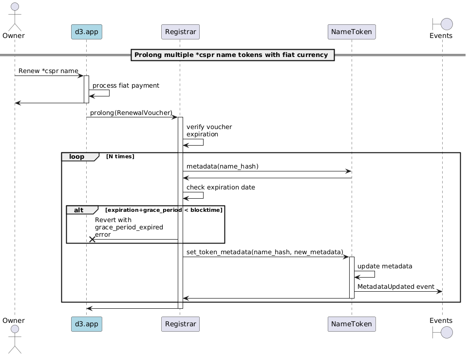
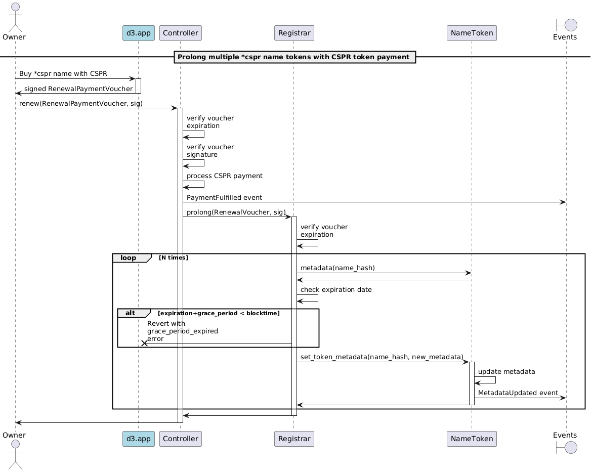

# Renew a domain

## Renew with fiat currency

> As a domain owner, I should be able to renew multiple *cspr name tokens with a fiat payment, so that the expiration date is extended.

[🔗](puml/offchain-renewal.puml)

## Renew with CSPR token

> As a domain owner, I should be able to renew multiple *cspr name tokens with a CSPR token payment, so that the expiration date is extended.

[🔗](puml/onchain-renewal.puml)

