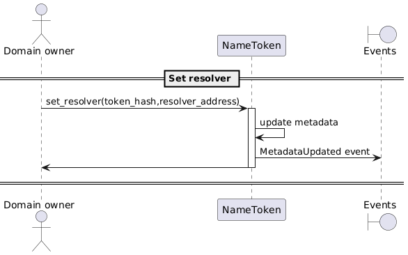
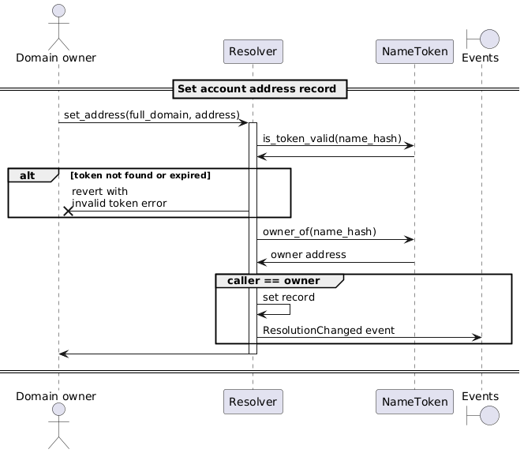
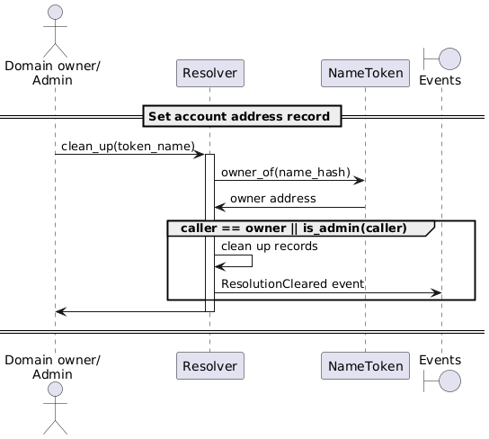
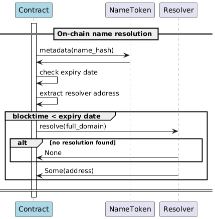
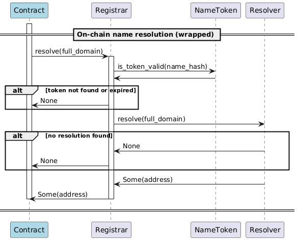
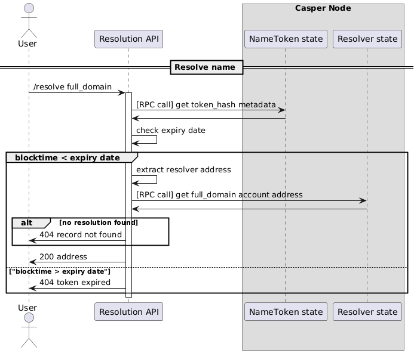

# Resolution

## Set a resolver

> As a *cspr name token owner, I must be able to set a resolver contract address for my name token.

[🔗](puml/set-resolver.puml)

## Set account address record

> As a *cspr name token owner, I must be able to set a record that resolves my domain or subdomain to an account address.

[🔗](puml/set-account-address-record.puml)

## Clean up name token

> As an admin or a *cspr name token owner, I must be able to clean up all records resolving addresses for the name token.

[🔗](puml/clean-up-records.puml)

## Resolve name

> As a external contract, I should be able to resolve the account address for a name.

[🔗](puml/onchain-name-resolution.puml) 

This logic is offered by the registrar's `resolve()` entry point:

[🔗](puml/onchain-name-resolution-wrapped.puml)

## Resolve name using RPC

> As a user, I can call a Resolution API to resolve the account address for a name.

[🔗](puml/resolve-name.puml)
