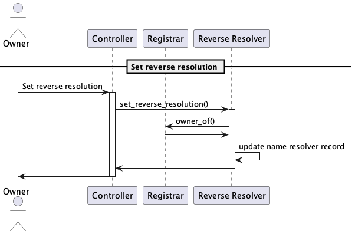
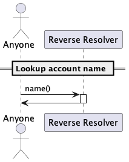

# Resolution

## Set a resolver

> As a domain owner, I must be able to set a resolver contract address for my domain.

[🔗](puml/set-resolver.puml)

## Set account address record

> As a domain owner, I must be able to set a record that resolves my domain name to an account address.

[🔗](puml/set-account-address-record.puml)

## Resolve name

> As a external contract, I should be able to resolve the account address for a name.

[🔗](puml/onchain-name-resolution.puml) 

The logic could be wrapped in a stored session call:

[🔗](puml/onchain-name-resolution-wrapped.puml)

## Resolve name using RPC

> As a user, I can call a Resolution API to resolve the account address for a name.

[🔗](puml/resolve-name.puml)

# Reverse resolution

TBC. Let's decide if we want to include reverse resolution in the first iteration. Or we postpone it for a later version.

## Set reverse resolution

[🔗](puml/set-reverse-resolution.puml)

## Look up account name

[🔗](puml/lookup-account-name.puml)
