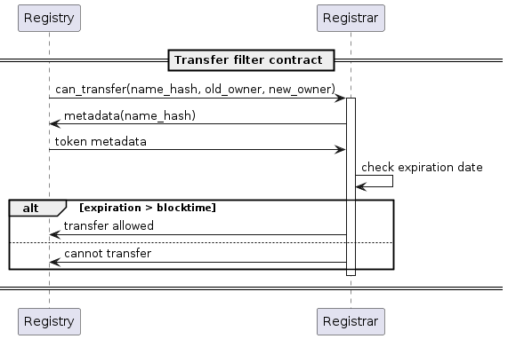
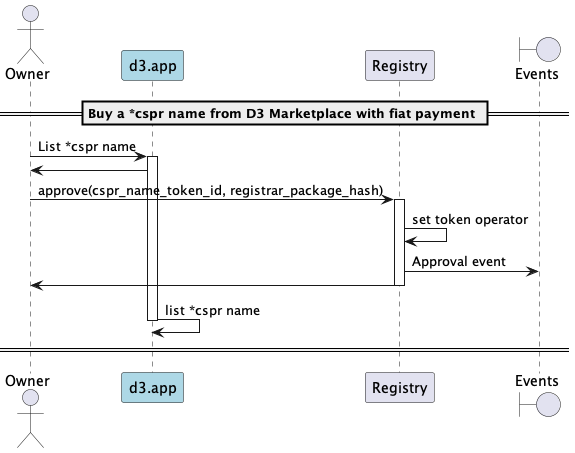
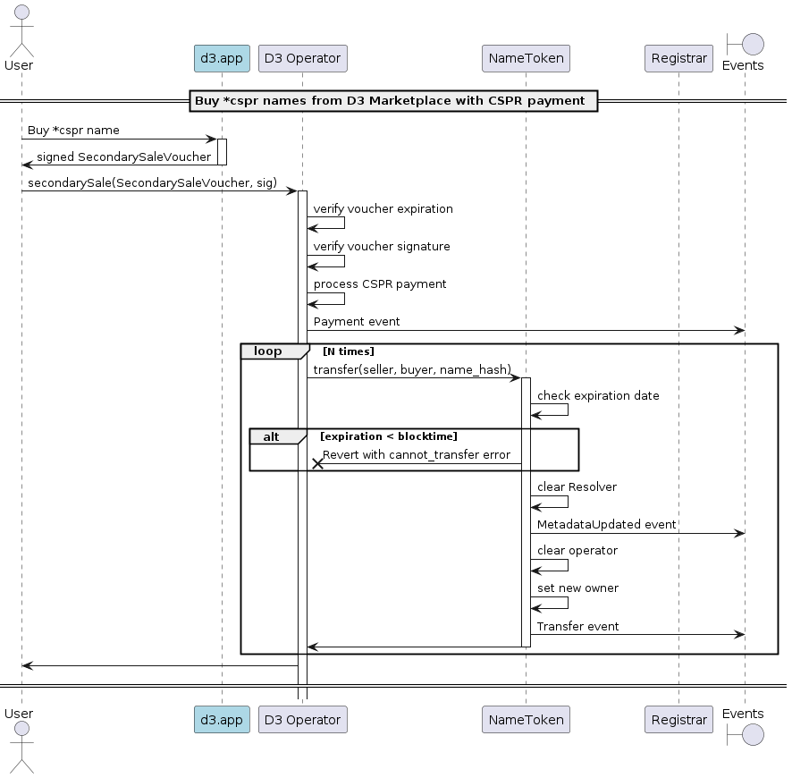
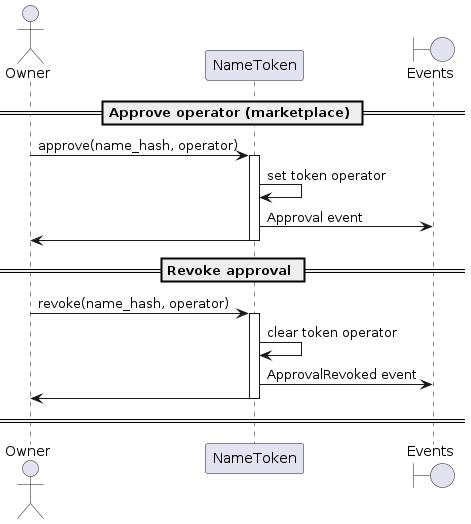
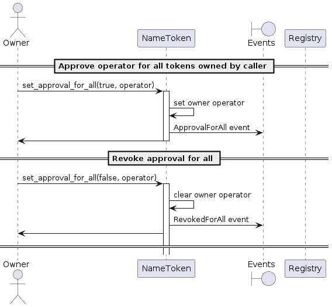
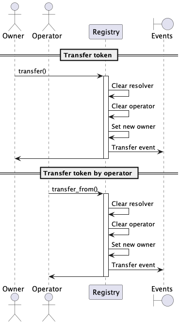
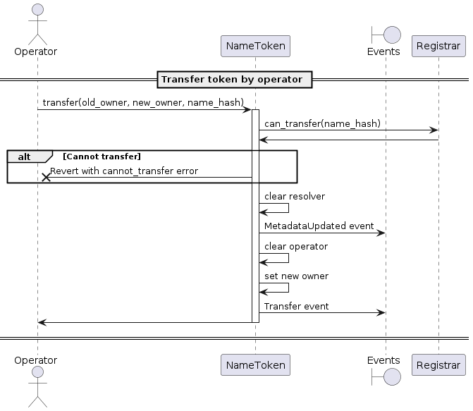

# Secondary-sale market

## can_transfer filter

> As the transfer filter contract for the NameToken, I should verify token expiration date,
> so that a name token can not be transferred during the renewal grace period.

_The transfer filter contract functionality can be added to the Registrar or to another contract._

[🔗](puml/transfer-filter-contract.puml)

## D3 Marketplace

_These flows are valid also for CSPR.market and other marketplaces._

### List a *cspr name in the D3 Marketplace

> As a *cspr name owner, I should be able to list my token in the D3 marketplace

[🔗](puml/d3-marketplace-list.puml)

### Buy a *cspr name from D3 Marketplace with CSPR token payment

> As a user, I should be able to buy one or more *cspr name listed in the D3 marketplace with a CSPR token payment

[🔗](puml/d3-marketplace-buy-cspr-token.puml)

## Private actions

### Approve / revoke an operator

> As a *cspr name owner, I should be able to approve an operator, so that it can transfer the token on my behalf

> As a *cspr name owner, I should be able to revoke the operator's permission

[🔗](puml/approve-revoke-operator.puml)

### Approve for all

> As an owner of one or more *cspr names, I should be able to approve an operator, so that it can transfer any of my tokens on my behalf

> As an owner of one or more *cspr names, I should be able to revoke the operator's permission

[🔗](puml/approve-for-all.puml)

### Transfer

> As a *cspr name owner, I should be able to transfer the ownership of the token to another account

[🔗](puml/transfer-domain.puml)

### Transfer from operator

> As a token operator, I should be able to transfer the ownership of the token to another account

[🔗](puml/transfer-from-domain.puml)

